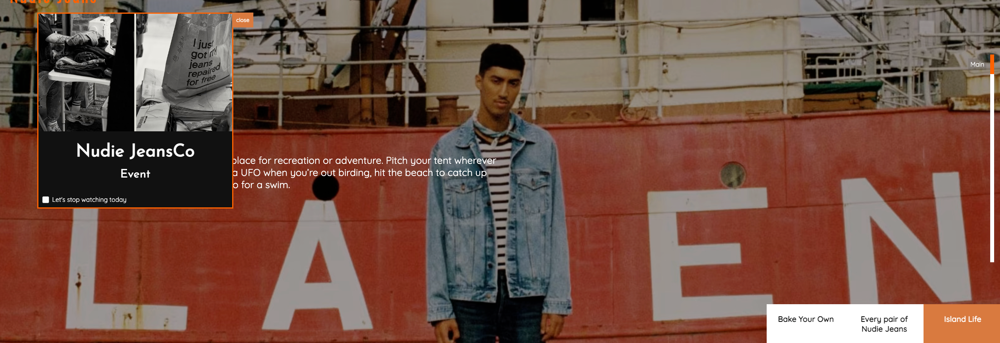

# 누디진 청바지 리뉴얼 페이지

   
  
   

## 프로젝트 소개

퍼블리셔로 일하면서 제이쿼리로 사이트 구축 및 운영을 많이 하였는대, 
제이쿼리의 사용을 줄이고 자바스크립트로 페이지 구현을 하였습니다.

 

## 기술 스택

       

 

## 구현 기능

- 쿠키팝업
- 스와이퍼 슬라이드
- 바닐라 스크립트 슬라이드
- fetch이용한 json 데이터 호출
- flickr, youtube 재생목록, api 호출
- kakao map api
- 회원가입 요건 설정 (id, password, checkbox, radio, e-mail)
- 롤링배너
- 자바스크립트 스크롤 모션
- gsap라이브러리를 활용한 스크롤 모션

 

## 배운 점 & 아쉬운 점

배운점  
fetch를 api 활용하여 json데이터를 가져오고  flickr, youtube 재생목록의 저장된 데이터 가져오는 것을 알게되었습니다.  
kakao map api의 세부 사항을 찾아보고 적용해 보았습니다.

아쉬운점  
gsap라이브러리를 활용한 스크롤 모션과 스크롤 모션을 더 인터랙티브하게 못만들어서 아쉽습니다.
